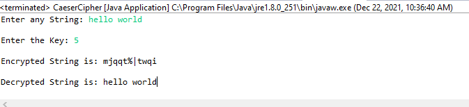
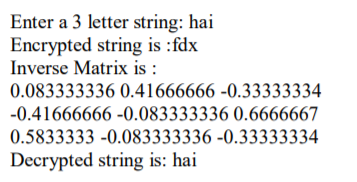

# Program 3

## Aim of the Program

Write a Java program to perform encryption and decryption using the following algorithms 
a. Ceaser Cipher

b.Substitution Cipher

c.Hill Cipher

### Output
##Ceaser Cipher Output

##Substitution Output

##Hill Cipher Output

